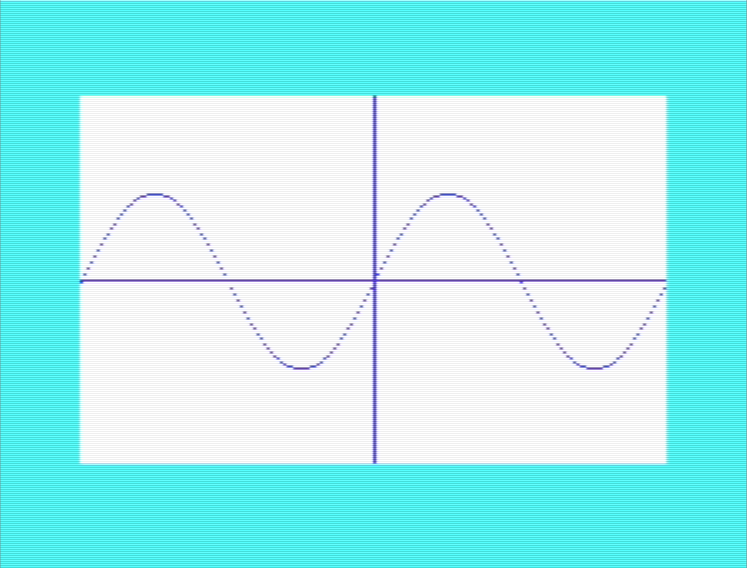

# vic20graphingdemos

A self-chaining reel of VIC-20 BASIC graphing demos: **sine -> cos ->
sinecos -> tan -> unitcircle -> sine ...**, looping forever. Each one plots
its curve against x/y axes using the same character-cell "bitmap" trick as
[vice-background-creator](../vice-background-creator)'s `sinecos.bas` (custom
characters redefined per screen cell, so the VIC's low-res text mode draws a
smooth-looking curve).



Every demo ends with a ~2 second pause (so you can actually see the finished
curve), then clears the screen and restores the normal character set, then
`LOAD"<next>",8,1`. On Commodore BASIC, executing `LOAD` from a *running*
program (not typed at the READY prompt) auto-RUNs whatever it just loaded -
so the reel chains from one demo to the next without ever holding more than
one demo's code in the VIC-20's RAM at once.

Note: the runner's own initial boot (typing `LOAD"sine",8,1` + `RUN` for
you) can occasionally fail to type the `RUN` - a VICE keybuf timing quirk.
If the emulator opens and just sits at READY., type `RUN` yourself once.

## Prerequisites

- [VICE](https://vice-emu.sourceforge.io/) (for `xvic` and `petcat`)
- PowerShell 7+ (`pwsh`) - the script uses `pwsh`-only syntax

## Configure

Copy `paths.ini.example` to `paths.ini` and point it at your local VICE
install:

```
cp paths.ini.example paths.ini
```

```ini
[VICE]
RootPath="C:\path\to\root\of\vice"
```

`paths.ini` is gitignored - it's machine-specific.

## Run

```
pwsh ./Run-GraphingDemos.ps1
pwsh ./Run-GraphingDemos.ps1 -Commented
pwsh ./Run-GraphingDemos.ps1 -Warp
```

This tokenizes the whole chain (`sine.bas` through `unitcircle.bas`, or their
`-commented.bas` companions with `-Commented`) via `petcat` into a temp work
directory, mounts that directory as VICE's device #8 filesystem, and boots
`xvic` with `LOAD"sine",8,1` + `RUN` typed in to start the reel. Closing the
emulator window ends the run and cleans up the work directory.

`-Commented` runs the REM-annotated companion listings instead - see
`CLAUDE.md` for how those are generated and kept in sync. They're roughly
double the size, which busts the unexpanded VIC-20's memory, so `-Commented`
also switches petcat's load address to `$0401` and adds VICE's `-memory 3k`
expander to compensate.

## The demos

- `sine.bas` - sin(x), full amplitude
- `cos.bas` - cos(x), full amplitude
- `sinecos.bas` - both curves overlaid at a smaller amplitude (from
  vice-background-creator)
- `tan.bas` - tan(x), clamped near its asymptotes so it doesn't blow up the
  plot
- `unitcircle.bas` - x=cos(t), y=sin(t) traced around a full circle
